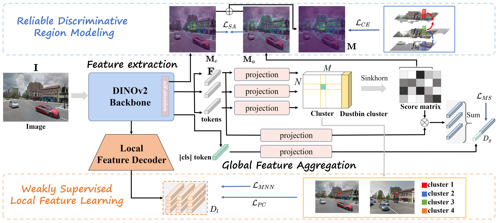

# Focus on Local: Finding Reliable Discriminative Regions for Visual Place Recognition

[](https://github.com/chenshunpeng/FoL/blob/main/LICENSE)
[](https://huggingface.co/shunpeng/FoL)
[](https://arxiv.org/abs/2504.09881)
[](https://github.com/chenshunpeng/FoL)

This is the official repository for the AAAI 2025 paper "FoL" available at [AAAI Paper Page](https://ojs.aaai.org/index.php/AAAI/article/view/32811). In addition, our paper and its extensive supplementary materials can be found on [arXiv](https://arxiv.org/abs/2504.09881).

## Summary

We introduce Focus on Local **(FoL)**, a two-stage Visual Place Recognition (VPR) approach that enhances image retrieval and re-ranking by identifying and leveraging **reliable discriminative local regions**. Our method introduces three key contributions:

- **Reliable Discriminative Region Modeling**: We propose two novel loss functions—**Extraction-Aggregation Spatial Alignment Loss (SAL)** and **Foreground-Background Contrast Enhancement Loss (CEL)**—to explicitly learn discriminative local regions.
- **Weakly-Supervised Local Feature Learning**: We leverage pseudo-correspondences from aggregated global features to improve local matching supervision.
- **Efficient Re-ranking with Discriminative Region Guidance**: We use the learned discriminative regions to guide local feature matching, improving accuracy and efficiency.

You may refer to our **anonymous conference version** of the paper: [anonymous conference version](2104_Focus_on_Local_Finding_Re.pdf)



## Setup & Requirements
**Quick install:**
```bash
# create and activate conda env
conda create -n fol python=3.9.19 -y
conda activate fol

# install dependencies
pip install -r requirements.txt
```
**Key dependencies:**
```
torch==2.0.0
torchvision==0.15.1
faiss-gpu==1.7.2
scikit-learn==1.3.0
numpy==1.26.4
opencv-python==4.10.0.84
```
> **Note — reproducibility:** The reranking step is sensitive to small numerical differences across `faiss-gpu`, `torch`, and `numpy` versions. Use the exact versions (in [requirements.txt](https://github.com/chenshunpeng/FoL/blob/main/requirements.txt)) to match paper results.

Install the Hugging Face Hub client (if you want to pull weights directly):

```bash
pip install huggingface_hub
```

## Download Pretrained Weights

You can download our pretrained FoL model either via Google Drive or directly from Hugging Face:

- **Google Drive (single files):**
  - FoL (ViT-L, FoL_large.pth): [link](https://drive.google.com/file/d/1-7LE_4Q0zL3S8lGVEH0Ob1NCFXq4KfJ8/view?usp=sharing)
  - FoL (ViT-B, FoL_base.pth): [link](https://drive.google.com/file/d/1Z05ZLFliQXOPJMH1YPdXqYjzC15-0nam/view?usp=sharing)

- **Google Drive (all models):** Shared folder "FoL_Trained_Models": [link](https://drive.google.com/drive/folders/1d3uEHdnzgWbGnj2g1ffLzLLI3pKuV7Vz?usp=sharing)

- **Hugging Face Hub**  
  ```python
  from huggingface_hub import hf_hub_download

  # this will download FoL.pth into your cache folder
  FoLpath = hf_hub_download(
      repo_id="shunpeng/FoL",
      filename="FoL.pth"
  )
  print("Downloaded weights to:", FoLpath)
  ```

> **Note:** Hugging Face Hub downloads the ViT-L checkpoint (`FoL_large.pth`) by default. For ViT-B (`FoL_base.pth`), use the Google Drive links above.

---

## Evaluation

Assuming you have your datasets under `/datasets/` and your weights in `/weights/FoL.pth`:

```bash
python eval.py \
  --eval_datasets_folder=/datasets/ \
  --dataset_names pitts30k amstertime \
  --resume=/weights/FoL.pth
```

## Train

```bash
python train.py --eval_datasets_folder=.../datasets/ --eval_dataset_name pitts30k --epochs_num=8 --train_batch_size=60 --lr=6e-5 --optim=adamw --resize 322 322 --save_dir train_log/
```

## Performance
 
This table lists R1, R5, and R10 for FoL across common VPR datasets, showing both **FoL-global** and **FoL-reranking** results. The best R1 value within each dataset row is typeset in $\color{red}{\mathbf{bold}}$. All results are reported for ViT-L at 504×504.

For Nordland variants: `Nordland*` uses 2,760 summer queries against a 27,592-image winter database, while `Nordland**` uses the full 27,592 winter queries against a 27,592-image summer database.

<table style="width:100%; border-collapse: collapse; font-size: 12px;">
  <thead>
    <tr>
      <th rowspan="2" style="text-align:left;">Dataset</th>
      <th colspan="3">global</th>
      <th colspan="3">re-ranking</th>
      <th rowspan="2" style="text-align:left;">Dataset</th>
      <th colspan="3">global</th>
      <th colspan="3">re-ranking</th>
    </tr>
    <tr>
      <th>R1</th><th>R5</th><th>R10</th>
      <th>R1</th><th>R5</th><th>R10</th>
      <th>R1</th><th>R5</th><th>R10</th>
      <th>R1</th><th>R5</th><th>R10</th>
    </tr>
  </thead>
  <tbody>
    <tr><td>Pitts250k-test</td><td>96.5</td><td>99.1</td><td>99.5</td><td>$\color{red}{\mathbf{97.0}}$</td><td>99.2</td><td>99.5</td><td>MSLS-val</td><td>93.1</td><td>96.9</td><td>97.4</td><td>$\color{red}{\mathbf{93.5}}$</td><td>96.9</td><td>97.6</td></tr>
    <tr><td>MSLS-challenge</td><td>78.7</td><td>90.8</td><td>93.0</td><td>$\color{red}{\mathbf{80.0}}$</td><td>90.9</td><td>93.0</td><td>Tokyo24/7</td><td>96.2</td><td>98.7</td><td>98.7</td><td>$\color{red}{\mathbf{98.4}}$</td><td>99.1</td><td>99.4</td></tr>
    <tr><td>Pitts30k</td><td>93.9</td><td>97.2</td><td>98.1</td><td>$\color{red}{\mathbf{94.5}}$</td><td>97.4</td><td>98.2</td><td>Sped</td><td>$\color{red}{\mathbf{92.1}}$</td><td>96.5</td><td>98.0</td><td>91.8</td><td>96.5</td><td>97.4</td></tr>
    <tr><td>Amstertime</td><td>64.6</td><td>84.3</td><td>88.2</td><td>$\color{red}{\mathbf{70.1}}$</td><td>89.0</td><td>91.8</td><td>Eynsham</td><td>91.7</td><td>95.3</td><td>96.2</td><td>$\color{red}{\mathbf{92.4}}$</td><td>95.8</td><td>96.6</td></tr>
    <tr><td>Nordland*</td><td>78.3</td><td>90.8</td><td>94.0</td><td>$\color{red}{\mathbf{85.8}}$</td><td>94.9</td><td>96.8</td><td>Nordland**</td><td>87.8</td><td>94.5</td><td>96.4</td><td>$\color{red}{\mathbf{92.6}}$</td><td>96.9</td><td>98.0</td></tr>
    <tr><td>SF-XL Night</td><td>53.4</td><td>65.9</td><td>71.7</td><td>$\color{red}{\mathbf{60.5}}$</td><td>72.8</td><td>75.8</td><td>SF-XL Occlusion</td><td>51.3</td><td>65.8</td><td>73.7</td><td>$\color{red}{\mathbf{61.8}}$</td><td>77.6</td><td>77.6</td></tr>
    <tr><td>SVOX</td><td>98.4</td><td>99.4</td><td>99.6</td><td>$\color{red}{\mathbf{98.9}}$</td><td>99.6</td><td>99.7</td><td>SVOX Sun</td><td>98.1</td><td>99.4</td><td>99.5</td><td>$\color{red}{\mathbf{98.8}}$</td><td>99.8</td><td>99.9</td></tr>
    <tr><td>SVOX Night</td><td>98.3</td><td>99.6</td><td>99.6</td><td>$\color{red}{\mathbf{98.8}}$</td><td>99.8</td><td>99.9</td><td>SVOX Snow</td><td>99.1</td><td>99.7</td><td>99.8</td><td>$\color{red}{\mathbf{99.3}}$</td><td>99.8</td><td>99.9</td></tr>
    <tr><td>SVOX Overcast</td><td>97.9</td><td>99.2</td><td>99.3</td><td>$\color{red}{\mathbf{98.3}}$</td><td>99.3</td><td>99.7</td><td>SVOX Rain</td><td>96.5</td><td>99.6</td><td>99.7</td><td>$\color{red}{\mathbf{98.2}}$</td><td>99.9</td><td>99.9</td></tr>
  </tbody>
</table>

### Additional Results at 322×322

The following table reports results at 322×322 on six datasets for both backbones.

<table style="width:100%; border-collapse: collapse; font-size: 12px;">
  <thead>
    <tr>
      <th rowspan="3" style="text-align:left;">Dataset</th>
      <th colspan="6"><a href="https://drive.google.com/file/d/1-7LE_4Q0zL3S8lGVEH0Ob1NCFXq4KfJ8/view?usp=sharing">ViT-L</a></th>
      <th colspan="6"><a href="https://drive.google.com/file/d/1Z05ZLFliQXOPJMH1YPdXqYjzC15-0nam/view?usp=sharing">ViT-B</a></th>
    </tr>
    <tr>
      <th colspan="3">global</th>
      <th colspan="3">re-ranking</th>
      <th colspan="3">global</th>
      <th colspan="3">re-ranking</th>
    </tr>
    <tr>
      <th>R1</th><th>R5</th><th>R10</th>
      <th>R1</th><th>R5</th><th>R10</th>
      <th>R1</th><th>R5</th><th>R10</th>
      <th>R1</th><th>R5</th><th>R10</th>
    </tr>
  </thead>
  <tbody>
    <tr><td>Pitts30k-test</td><td>93.6</td><td>96.9</td><td>97.9</td><td>$\color{red}{\mathbf{93.9}}$</td><td>96.9</td><td>98.1</td><td>92.1</td><td>96.4</td><td>97.6</td><td>$\color{red}{\mathbf{93.1}}$</td><td>96.9</td><td>97.7</td></tr>
    <tr><td>MSLS-val</td><td>$\color{red}{\mathbf{92.8}}$</td><td>96.9</td><td>97.2</td><td>90.1</td><td>95.7</td><td>96.9</td><td>91.1</td><td>95.7</td><td>96.4</td><td>$\color{red}{\mathbf{91.5}}$</td><td>96.2</td><td>96.8</td></tr>
    <tr><td>Nordland**</td><td>83.8</td><td>92.6</td><td>95.1</td><td>$\color{red}{\mathbf{87.9}}$</td><td>94.8</td><td>96.6</td><td>72.7</td><td>85.5</td><td>89.6</td><td>$\color{red}{\mathbf{85.4}}$</td><td>92.7</td><td>94.8</td></tr>
    <tr><td>Tokyo24/7</td><td>96.5</td><td>98.1</td><td>98.4</td><td>$\color{red}{\mathbf{97.1}}$</td><td>97.8</td><td>98.7</td><td>94.6</td><td>96.5</td><td>96.8</td><td>$\color{red}{\mathbf{97.5}}$</td><td>98.1</td><td>98.4</td></tr>
    <tr><td>Nordland*</td><td>74.1</td><td>88.8</td><td>92.2</td><td>$\color{red}{\mathbf{80.8}}$</td><td>92.0</td><td>94.7</td><td>62.5</td><td>80.3</td><td>85.0</td><td>$\color{red}{\mathbf{78.2}}$</td><td>90.2</td><td>92.9</td></tr>
    <tr><td>Eynsham</td><td>91.5</td><td>95.1</td><td>96.1</td><td>$\color{red}{\mathbf{91.7}}$</td><td>95.4</td><td>96.4</td><td>$\color{red}{\mathbf{91.3}}$</td><td>95.2</td><td>96.0</td><td>$\color{red}{\mathbf{91.3}}$</td><td>95.1</td><td>96.1</td></tr>
  </tbody>
</table>

## Related Work
Our another ICLR 2026 work (single-stage VPR based on DINOv2) [SAGE](https://openreview.net/forum?id=DCpbEXqPvS) achieved SOTA performance on several datasets. The code is released at [here](https://github.com/chenshunpeng/SAGE).


## Acknowledgements
This code is based on the excellent work of:
 - [SelaVPR](https://github.com/Lu-Feng/SelaVPR), [CricaVPR](https://github.com/Lu-Feng/CricaVPR)
 - [SALAD](https://github.com/serizba/salad)
 - [Visual Geo-localization benchmark](https://github.com/gmberton/deep-visual-geo-localization-benchmark), [VPR-datasets-downloader](https://github.com/gmberton/VPR-datasets-downloader)
 - [GSV-Cities](https://github.com/amaralibey/gsv-cities), [MixVPR](https://github.com/amaralibey/MixVPR)

## Citation

If you find this repo useful for your research, please cite the paper

```
@inproceedings{FoL,
  title={Focus on Local: Finding Reliable Discriminative Regions for Visual Place Recognition},
  author={Wang, Changwei and Chen, Shunpeng and Song, Yukun and Xu, Rongtao and Zhang, Zherui and Zhang, Jiguang and Yang, Haoran and Zhang, Yu and Fu, Kexue and Du, Shide and others},
  booktitle={Proceedings of the AAAI Conference on Artificial Intelligence},
  volume={39},
  number={7},
  pages={7536--7544},
  year={2025}
}
```
